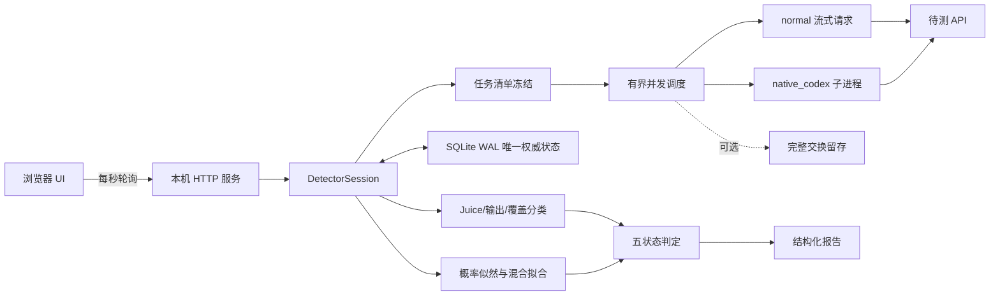

# GPT-5.6 vNext 混用检测器技术报告

版本：`4.0.0`
实现根目录：`gpt56_vnext/`
评分版本：`trusted-likelihood-v2`

## 摘要

GPT-5.6 vNext 是一个本地运行的 API 混用检测器。它的目标不是对任意未知模型作开放世界身份证明，而是检查一个申报为 GPT-5.6 Sol、Terra 或 Luna 的 OpenAI-compatible 端点，是否出现以下可观测异常：

1. Juice 返回另一个已知型号的确定性指纹。
2. 固定输出在响应端被替换。
3. 上游额外注入了简单的 Juice 语义覆盖。
4. 固定行为题的答案分布更接近另一可信子模型或可辨识的混合分布。
5. 只对某种请求格式、首次/短上下文或特定客户端轮廓路由真模型。

正式检测不需要可信 API。可信 Sol、Terra、Luna 只在离线标定阶段使用，生成冻结概率基线。运行时只向待测端发送流式请求。

本报告的实现事实全部来自当前项目源码、冻结资源、标定产物和本地测试。文末论文与开源项目仅用于说明统计方法背景和研究脉络，不作为本项目协议或行为的实现依据。

## 1. 范围与非目标

### 1.1 检测对象

当前正式型号集合为：

```text
gpt-5.6-sol
gpt-5.6-terra
gpt-5.6-luna
```

Juice 层额外识别 GPT-5.5、GPT-5.4、GPT-5.4-mini 的已知值，用于报告疑似旧型号混入。

### 1.2 本项目能提供的证据

- 确定性异常：错误型号 Juice、32/48 输出替换、明确隐藏覆盖。
- 相对身份证据：待测行为分布在冻结三模型基线中更像谁。
- 混合证据：单一模型解释与三模型混合解释之间的对数似然增益。
- 请求路径差异：普通与 Native Codex 轮廓、短与固定 32K 上下文之间的结果差异。
- 运行完整性：逻辑任务、HTTP 尝试、错误类别、恢复状态和留存哈希。

### 1.3 明确不声称

- 不声称“通过”等于端到端来源证明。
- 不声称能排除透明代理或探针识别。
- 不声称能覆盖普通业务请求的差异化路由。
- 不声称 Native Codex 轮廓在所有系统和未来版本上逐字节相同。
- 不把模型自报“没有额外系统提示”当作可信事实。
- 不把网络错误当作模型身份错误。

## 2. 权威实现与发行边界

正式运行树只包含新的 `gpt56_vnext`：

| 文件 | 职责 |
|---|---|
| `presets.py` | 冻结低/中/高预设、配置规范化、参数哈希、请求估算 |
| `detector.py` | 任务生成、持续抽签、并发调度、分类、滚动窗口、报告 |
| `transport.py` | 普通流式请求、Native 子进程适配、SSE 完整性 |
| `juice.py` | Juice 表、两阶段型号分类、输出完整性和覆盖分类 |
| `normalizers.py` | 三个内置概率探针的冻结答案归一化 |
| `probability_model.py` | JSD、漂移收缩、似然、EM 混合、回放标定和门禁 |
| `verdict.py` | 五状态最终判定与严重标题集合 |
| `store.py` | SQLite WAL、单写入器、任务/尝试/结果/事件/粘性告警 |
| `retention.py` | 可选完整交换留存、脱敏、哈希和完整性清单 |
| `generator.py` | 自定义可信分布生成、分析、签名、恢复 |
| `server.py` | 本机 HTTP 服务、会话恢复、Web API、生命周期 |
| `web/` | 检测器和生成器前端 |

旧 COT、旧 GUI、旧 JSONL checkpoint 和旧评分器均不在当前发行允许清单中。构建脚本按显式 allowlist 复制文件，并扫描旧模块引用、报告、SQLite、缓存、私有模板、凭据模式和个人路径。

公开包与内部包只有 Juice 模板目录不同。概率基线、评分代码和判定逻辑完全相同。

## 3. 总体架构



重要边界：UI 内存不是权威状态。浏览器只读取服务端从 SQLite 重建的进度和报告。服务重启后扫描运行目录，恢复最近的检测器和生成器会话。

## 4. 冻结运行预设

### 4.1 单次检测

#### 低档：14 条

| 项目 | 次数 | 档位 |
|---|---:|---|
| Juice | 8 | high |
| Juice | 3 | low |
| 固定输出 | 1 | 48 |
| 固定输出 | 1 | 32 |
| Juice 覆盖 | 1 | high |

只使用 `normal + no_history`。

#### 中档：64 条

| 项目 | 次数 |
|---|---:|
| high / low / xhigh / max Juice | 12 / 6 / 6 / 6 |
| 48 / 32 输出 | 1 / 1 |
| Juice 覆盖 | 2 |
| 固定随机国家 | 20 |
| B80 | 10 |

只使用 `normal + no_history`。

#### 高档：202 条

高档启用：

```text
request_format = normal, native_codex
context_mode   = no_history, fixed_32k_history
```

除 B80 外，各探针在四种组合中重复：

| 项目 | 每种组合次数 |
|---|---:|
| high Juice | 8 |
| low / medium / xhigh / max Juice | 各 4 |
| 48 / 32 输出 | 各 1 |
| Juice 覆盖 | 2 |
| 固定随机国家 | 10 |
| 固定随机鸟 | 10 |

四种组合共 `48 × 4 = 192` 条。B80 只在 `normal + no_history` 运行 10 条，总计 202 条。

### 4.2 持续监控

每轮的语义是：

```text
对每个已启用项目独立生成安全随机数
若 random < probability_percent / 100，则本轮纳入该项目
将本轮所有选中任务一次性冻结到 SQLite
执行冻结清单
从 [min_interval, max_interval] 均匀抽取整数秒等待
```

预设参数：

| 档位 | 随机间隔 | high Juice | 其他主要项目 |
|---|---|---:|---|
| 低 | 150–210 秒 | 100%，窗20 | low 50%窗10；输出/覆盖各25%窗20 |
| 中 | 240–360 秒 | 100%，窗20 | low 50%；xhigh/max 25%；国家/B80 50% |
| 高 | 480–720 秒 | 100%，窗20 | 其他 Juice 25%；确定性项目25%；国家/鸟/B80 50% |

高档对选中的普通项目扩展为四种格式/上下文组合。B80 固定只使用 `normal + no_history`，避免把未经标定的组合当成正式单元。

持续窗口只取最近 N 条满足该探针有效性条件的结果。严重异常写入 `sticky_alerts`，在会话结束前不会因窗口滚动恢复正常而消失。

### 4.3 预设身份

配置规范化后，对所有影响检测的字段生成 SHA-256：并发、重试、格式、上下文、探针参数、自定义探针和持续调度参数全部在哈希内。

只有哈希与内嵌低/中/高预设精确相等，报告才标记为冻结预设。任何修改都成为自定义参考档，不能借用冻结预设的整体验证结论。

## 5. 上游请求协议

本节只描述本项目 `transport.py`、`native/codex-native-transport.mjs`、清理后的抓包资产和无网络构造测试所实现的行为。

### 5.1 强制流式

所有正式上游请求都使用 `/responses` 路径并开启流式：

- `stream: true`
- `store: false`
- 显式思考档位
- 请求 reasoning encrypted content
- 每个逻辑任务使用唯一 cache key

普通传输逐行读取 SSE，记录首事件耗时、总耗时和事件数。只有观察到终止事件 `response.completed`、`response.incomplete` 或 `response.failed` 才认为流完整；收到终止事件后立即结束本次读取，不再等待服务器关闭连接。连接关闭但没有终止事件会被分类为不完整流，不能进入成功样本。

### 5.2 normal 格式

`normal` 由 Python 直接构造项目定义的流式 Responses JSON。它用于最低成本的标准检测，也是低/中档唯一请求格式。

### 5.3 native_codex 格式

Native 适配器从 `native-0.147.0.raw` 复现本项目本地抓包的请求轮廓：

- 原始清理资产 43,313 bytes。
- 资产 SHA-256 为 `4f9d6e...`，完整值由发行 `SHA256SUMS.txt` 提供。
- UUID、会话元数据、日期和探针输入动态生成。
- 工作目录固定为无个人信息的 `C:\workspace`。
- 认证只通过临时环境变量 `GPT56_NATIVE_AUTHORIZATION` 传给子进程，构造后删除。
- 可留存的清理请求不包含认证值和个人路径。

它的用途是做差分路由检测，不是宣称成为某个外部客户端的官方实现。

### 5.4 固定 32K 上下文

`fixed_32k_history.json` 包含 128 条固定伪造历史。选择该模式时，在真实探针前加入约 32K 输入上下文，单请求估算使用 33,792 input tokens。

同一探针在短上下文和固定长上下文中的结果可用于发现“首次请求给真模型，后续长会话降级”的策略。固定历史是发行资源，便于所有用户复现同一条件。

## 6. 状态、并发、重试与恢复

### 6.1 SQLite 是唯一权威状态

数据库启用：

```text
journal_mode = WAL
synchronous = FULL
foreign_keys = ON
busy_timeout 已配置
```

核心表：

- `sessions`：会话配置、哈希、状态。
- `jobs`：冻结逻辑任务。
- `attempts`：每次真实 HTTP 尝试。
- `results`：逻辑任务最终结果。
- `events`：轮次开始、恢复、结束、睡眠等事件。
- `sticky_alerts`：粘性严重告警。

所有写入通过单 writer 线程串行提交，避免并发工作线程直接争用连接。

### 6.2 有界完成即补位

默认 `workers=8`，范围 1–32。调度器最多维持指定数量的 in-flight 任务；任一任务完成即补下一条，不按固定批次等待最慢请求。

### 6.3 累计重试预算

默认 `retries=2`，所以每个逻辑任务最多 3 次 HTTP 尝试。预算累计保存在数据库中：重启后不会重新获得 3 次。

- 已成功任务永不重发。
- 可重试错误才进入下一次尝试。
- 崩溃留下的 `running` attempt 在恢复时对账。
- 超出累计预算的任务进入最终错误。
- 用户停止时，未发送任务取消；已发送且耗尽的任务保留错误事实。

### 6.4 冻结任务清单

单次检测先冻结完整清单。持续监控每轮先抽签、再冻结。本轮中途崩溃后恢复的是数据库里的原清单，不会重新抽签，也不会因为代码重新运行而改变已经承诺的任务。

## 7. 确定性层一：Juice

### 7.1 为什么使用恒等变形

若要求模型把 Juice 乘 2 后直接输出，新答案可能产生新的非稳定数字。当前模板只使用结果等于原始 Juice 的恒等式，使现有指纹表仍可直接核验。

公开模板包括：

1. 除 2、乘 10、除 5。
2. 乘 2、除 2，并加入随机 nonce。
3. JSON 外壳下加 7、减 7，并加入随机 nonce。

内部包加载额外私有冻结模板池。模板选择和 nonce 只降低固定请求缓存与关键词过滤的便利性，不改变判定标准。

### 7.2 已知 Juice 表

| 型号 | low | medium | high | xhigh | max |
|---|---:|---:|---:|---:|---:|
| Sol | 8 或 8 前缀长值 | 16 或 16 前缀长值 | 40 或 40 前缀长值 | 128 | 960 |
| Terra | 12 | 16 | 32 | 84 | 960 |
| Luna | 8 | 16 | 48 | 128 | 768 |

旧型号表：

| 型号 | low | medium | high | xhigh/max 已知值 |
|---|---:|---:|---:|---|
| GPT-5.5 | 12 | 24 | 96 | xhigh 768；max 未定义 |
| GPT-5.4 | 12 | 20 | 96 | xhigh 512；max 未定义 |
| GPT-5.4-mini | 8 | 24 | 64 | xhigh 768；max 未定义 |

旧型号并非每个档位都有独立字段；运行代码以 `juice.py` 中的冻结签名为准。

### 7.3 两阶段分类

对数值答案 `x`、申报型号 `M`、思考档位 `e`：

```text
if matches(M, e, x):
    current_success
elif exists other known model K where matches(K, e, x):
    mixed(K)
else:
    unsuccessful
```

顺序是关键。Sol/Terra/Luna 在部分档位共享 `8`、`16`、`128`、`960`。只要先符合申报型号，就不能因为也符合其他型号而报警。

拒答、非数字和未知数字属于 `unsuccessful`；连接错误单独归入网络质量。

### 7.4 Juice 汇总

Juice 通过要求：

1. 每个已启用思考档位至少有一条 `current_success`。
2. 所有有效 Juice 行中没有 `mixed`。

若每个档位已有足够有效样本，但全部既非当前成功也非已知混用，则进入“可能非GPT”。若某个档位没有足够有效数据，则不形成正式结论。

质量提示不会改变概率层分数：某档位仅一条成功，或总成功率低于 50%，只降低 Juice 数据质量说明。

## 8. 确定性层二：输出完整性

固定输出探针分别要求精确返回字符串 `48` 和 `32`。分类规则极简：

```text
strip(answer) == expected  -> pass
请求成功但不精确相等      -> hard anomaly
网络/协议失败              -> network quality only
```

持续模式在两个值之间交替，避免每轮只测同一个型号特征。该层不推断模型是谁，只检查响应是否被中转替换。

## 9. 确定性层三：简单 Juice 覆盖

### 9.1 请求构造

覆盖探针在 developer 消息中将随机合成整数 `N` 定义为本轮权威 Juice，再在 user 消息中要求乘 2、除 2，最终只输出整数。

高频词统一采用同一种 `J U I C E`、`N U M B E R`、`V A L I D C H A N N E L S` 空格大写形式，避免一个模板同时包含多种写法而扩大可匹配特征。

`N` 的生成范围是 10000–99999，并排除：

- 十进制前缀 `8`、`16`、`40`。
- 所有已知 Juice 数值，包括 8、12、16、20、24、32、40、48、64、84、96、128、512、768、960。
- 已知 Sol high 长值 4085、40805、40855、40085。

### 9.2 判定

| 输出 | 分类 | 是否严重 |
|---|---|---|
| 精确 `N` | `pass` | 否 |
| `40` 或 40 前缀长数字 | `explicit_hidden_override` | 是 |
| 其他已知 Juice | `suspected_explicit_definition_ignored` | 是 |
| 其他值/非数字 | `inconclusive` | 否 |

该设计只针对一种明确威胁：中转在项目自带 developer 指令之外，再注入“任何 Juice 请求都按 Sol high 的 40/40xxx 返回”之类的简单覆盖。它不通过模型自报提示内容，也不把任意失败夸大成注入证据。

## 10. 概率层：固定行为指纹

### 10.1 三个冻结探针

| ID | 固定题面 | 归一化 |
|---|---|---|
| `rand_country` | `Name a random country. Reply with ONLY the country name.` | 英文标签清理 |
| `rand_bird` | `Name a random bird. Reply with ONLY the bird name, one word.` | 英文标签清理 |
| `b80_letter_count` | `Count the letter r in strawberry. Reply only with the integer.` | 整数映射为 `exact_3` / `other_integer` |

题面 SHA-256、developer 提示哈希、思考档位、请求格式、上下文模式和 normalizer 哈希共同构成运行契约。题面不能语义改写后继续借用原基线。

国家和鸟归一化器会清理首尾空白、引号和常见尾部标点，折叠空格并大小写归一；它不会把任意长句强行裁成国家或鸟。B80 先要求完整输出可解析为整数，再按是否等于 3 分类。

### 10.2 冻结可信基线

基线文件：`baselines/trusted_likelihood_v2.json`

冻结事实：

| 项目 | 值 |
|---|---:|
| 基线内容 SHA-256 | `dd692466ea601d99b737edae66a35941f236d5e7426244f2c04e43f314f43851` |
| 正式 calibration 数 | 4 |
| 每个 calibration 回放 | 600 |
| 回放错误 | 0 |
| Wilson 95% 错误率上界 | 0.0063617010 |
| 总体覆盖率 | 1.0 |
| 最差时间窗覆盖率 | 1.0 |

每个正式单元的三个模型至少有四个可信时间窗。上述数字是当前冻结产物的验证结果，不代表未来任意端点、任意题面或任意参数也能达到同样表现。

## 11. 概率模型数学内核

### 11.1 符号

- 模型集合 `M = {Sol, Terra, Luna}`。
- cell 是 `probe_id + request_format + context_mode`。
- `c` 表示离散答案类别。
- `n_{m,c}` 是可信模型 `m` 对类别 `c` 的计数。
- `x_c` 是待测窗口的类别计数。
- 平滑常数 `alpha = 0.5`。

每个 cell 额外加入 `__OTHER__` 和 `__INVALID_OUTPUT__`，避免未知答案被静默删除。

### 11.2 Dirichlet/Laplace 平滑

对类别集合 `C`：

```math
p_m(c)=\frac{n_{m,c}+\alpha}{\sum_{j\in C}n_{m,j}+\alpha|C|},\qquad \alpha=0.5
```

平滑防止可信基线中没出现过的类别产生零概率和无穷负对数似然。

### 11.3 Jensen–Shannon 距离

两个离散分布 `P`、`Q` 的 JSD：

```math
\operatorname{JSD}(P,Q)=\frac{1}{2}D_{KL}(P\|M)+\frac{1}{2}D_{KL}(Q\|M),\quad M=\frac{P+Q}{2}
```

实现使用 `log2`，因此 JSD 位于 `[0,1]`。

对每个 cell：

- `S`：Sol/Terra/Luna 聚合分布两两 JSD 的平均值，表示模型间可分性。
- `D`：同一模型不同可信时间窗两两 JSD 的平均值，再跨模型平均，表示时间漂移。

### 11.4 漂移收缩权重

```math
w=\operatorname{clip}\left(\frac{S-D}{S+\tau},0,1\right)
```

其中 `tau` 从以下冻结网格选择：

```text
0, 0.005, 0.01, 0.02, 0.05, 0.10, 0.20
```

若模型间差异不大于时间漂移，则 `w` 接近 0，该 cell 自动收缩到三模型合并分布，不会以噪声制造身份置信度。

令 `p_pool(c)` 为三模型平均分布，实际似然分布为：

```math
\tilde p_m(c)=w p_m(c)+(1-w)p_{pool}(c)
```

### 11.5 单 cell 似然

待测计数 `x_c` 在模型 `m` 下的平均对数似然：

```math
\ell_{cell}(m)=\frac{1}{N}\sum_c x_c\log \tilde p_m(c)
```

使用平均值而不是总和，避免样本数更大的 profile 自动获得更大权重。

### 11.6 探针 family 防重复计票

同一个探针可能在普通/Native、短/32K 四个 profile 中出现。它们不是四个完全独立的探针。

实现先按 `probe_id` 组成 family：

1. 以各 profile 的 `w` 对平均对数似然加权平均。
2. family 总权重取 `min(1, max(profile_weights))`。
3. 每个探针 family 对总分最多贡献一份权重。

这样格式扩展用于寻找路由差异，但不会把同一道题复制四次后虚增统计证据。

### 11.7 三模型相对概率

先验均匀：

```math
s_m=\log(1/3)+\sum_f w_f\ell_f(m)
```

再以冻结温度 `T` 校准：

```math
P(m\mid x)=\operatorname{softmax}(s_m/T)
```

温度从 `0.05, 0.10, 0.20, 0.50, 1, 2, 5` 中按留窗回放多分类 log loss 选择。

这里的 `P` 只是在三模型冻结基线条件下的相对匹配概率。若实际模型不在集合中，概率仍会归一化为 100%，所以必须结合 OOD、覆盖率和“可能非GPT”逻辑阅读。

### 11.8 OOD 单元隔离

每个 cell 使用可信留出窗口的最佳局部拟合分数建立 1% 分位阈值。待测 cell 完整但最佳模型平均对数似然仍低于阈值时，标记：

```text
isolated_ood = true
ood_reason = below_trusted_heldout_1pct
```

该 cell 从身份 family 中隔离，其他正常 cell 继续评分。项目不会因一个异常格式输出把整套概率证据全部清零，也不会让异常 cell 强行投给“最不差”的已知模型。

### 11.9 EM 混合拟合

纯模型只能解释 `q=(1,0,0)`、`(0,1,0)` 或 `(0,0,1)`。混合模型估计：

```math
q_{Sol}+q_{Terra}+q_{Luna}=1,\qquad q_m\ge0
```

类别概率为：

```math
p(c\mid q)=\sum_m q_m\tilde p_m(c)
```

实现用确定性 EM，从均匀和三个偏置初始点开始，最多 500 次迭代，收敛阈值 `1e-10`。报告给出：

- 最佳混合比例。
- 最佳混合与最佳纯模型的对数似然增益 `mixture_gain`。
- 第二大可辨识模型组的份额 `second_share`。
- 不可区分模型组。

若两个模型在所有有效 cell 的使用分布完全相同，它们会合并成一个不可辨识组，而不是强行各报 50%。

## 12. 离线标定与正式门禁

### 12.1 留一时间窗回放

对每个可信时间窗：

1. 留出该窗作为候选。
2. 用其他窗口拟合分布、S、D、w。
3. 按运行时样本数从留出窗经验分布抽样。
4. 计算纯型号、混合和弃权结果。
5. 跨模型、窗口和 calibration 累积错误与覆盖。

### 12.2 `tau` 选择

候选 `tau` 的排序优先级是：

1. 最差窗口误判率更低。
2. 总体覆盖率更高。
3. 仍相同时选择更小 `tau`。

这避免只优化总体平均、却牺牲某个时间窗。

### 12.3 冻结门槛

| 门禁 | 阈值 |
|---|---:|
| 正式基线最少可信时间窗 | 3 |
| 最低有效输出率 | 95% |
| 正式通过错误率 Wilson 95% 上界 | ≤ 5% |
| 总体覆盖率 | ≥ 90% |
| 最差时间窗覆盖率 | ≥ 80% |
| 严重概率报警误报率 Wilson 95% 上界 | ≤ 1% |
| 混合模型第二份额 | ≥ 10% |

阈值不是仅靠点估计判断。零次回放错误也不等于真实错误率为零，因此报告使用 Wilson 上界表达有限样本的不确定性。

### 12.4 数据完整性门禁

正式概率评分要求：

- 运行契约与基线哈希一致。
- 每个需要的 cell 达到运行时样本数。
- 输出经过对应冻结 normalizer。
- 不完整流、网络错误和无效输出不冒充有效类别。
- 正式 calibration 本身通过错误率、覆盖率和报警误报门槛。

缺任一项，返回证据不足原因，而不是选择最接近的型号。

## 13. 自定义探针生成器

### 13.1 输入

生成器接受：

- 自定义 `probe_id` 和名称。
- 固定 user 提示与可选 developer 提示。
- 三个可信模型名。
- 思考档位。
- normal / native_codex。
- no_history / fixed_32k_history。
- 每模型样本数、时间窗数、窗间隔、并发和重试。
- 默认或高级答案归一化器。

题面应尽量要求短、可客观归类的输出。题面一旦成为 cell 定义，就不能随意改写后继续复用基线。

### 13.2 单时间窗政策

一个时间窗即可完成采样、描述分析、导出和导入。页面显示：

- 三模型各自计划数、成功数、有效数。
- 缺失模型。
- 各 profile 的参考 S、D、tau、w。
- 最低窗口样本和窗口数。

三个以上时间窗才可能运行与正式基线同类的跨窗回放，但当前版本仍不会让自定义探针影响正式结论。

### 13.3 文件完整性

导出文件分离两类数据：

- 签名源文档：题面、哈希、可信 raw counts、normalizer 和 profile 契约。
- 可变运行参数：检测次数、持续概率、窗口大小、启用状态。

验签只针对签名源文档。浏览器把 `0.0` 序列化成 `0` 或用户修改运行次数，都不会破坏源文档哈希。旧的单窗口文件如果缺少派生 cell，运行时可从已签名 raw counts 生成参考统计，但不会改写原文件或放宽验签。

### 13.4 当前正式边界

所有导入自定义探针固定为 `reference_only`：

- 可以发送请求。
- 可以显示分布、JSD 和相对概率。
- 可以出现在报告中。
- 不能阻塞内置概率结论。
- 不能产生正式通过或严重混用标题。

原因是不同时间生成的自定义探针不能简单按“窗口1”与内置探针的“窗口1”强行配对，也不能要求每个探针单独区分全部模型。正式联合需要另行设计跨探针校准。

## 14. 五状态判定机

正式标题集合严格冻结为：

```text
可能非GPT
Juice混用
仅概率探针混用
Juice通过但概率探针证据不足
通过
```

判定优先级：

1. Juice 在所有启用档位有足够有效样本但全部无法识别：`可能非GPT`。
2. Juice 命中其他型号，或 32/48、覆盖探针出现 hard anomaly：`Juice混用`。
3. Juice 通过，正式概率层达到纯替换或混合报警门槛：`仅概率探针混用`。
4. Juice 通过，但启用的正式概率层缺样本、OOD、契约不符或未过门禁：`Juice通过但概率探针证据不足`。
5. Juice 通过，且未启用概率层，或正式概率层完整并支持申报型号：`通过`。

若 Juice 数据不足：

```text
overall_verdict = null
operational_status = juice_data_insufficient
```

它是未形成结论，不是第六标题，也不能写成“Juice通过”。

### 14.1 粘性严重告警

`可能非GPT`、`Juice混用`、`仅概率探针混用` 属于严重标题。首次出现时写入 SQLite。后续滚动窗口恢复正常，报告仍保留首次严重标题及失败项，直到该会话结束。

### 14.2 自定义档位

自定义档位沿用相同展示逻辑，但标题带参考标识，页面说明“不受冻结预设可信度担保”。只有精确匹配预设哈希的低/中/高档才属于已验证组合。

## 15. 线路质量与错误隔离

错误按阶段和类别保存，例如：

- 连接失败。
- 超时。
- HTTP 非成功状态。
- SSE 不完整。
- 上游终止事件报告失败。
- 响应解析失败。
- 输出无法通过 normalizer。

可信拒答不自动等同候选失败，网络错误也不进入模型类别。报告分别展示：逻辑任务数、HTTP 尝试数、重试数、错误任务、in-flight 数和有效样本缺口。

顶层 Web 错误经过脱敏后显示具体原因，而不是只显示 `ValueError` 或 `FileNotFoundError`；认证值、完整 key 和敏感路径不会回显。

## 16. 完整交换留存

### 16.1 数据内容

启用后，每条交换写入 JSONL：

- record/job/attempt/request ID。
- 时间、脱敏 URL、请求格式、上下文模式。
- 模型、思考档位、逻辑状态。
- 脱敏请求头和完整请求正文。
- 完整原始流式响应。
- HTTP 状态、耗时、TTFE、事件数。
- 解析结果、错误阶段和类别。
- 内容 SHA-256。

索引与 manifest 记录记录数、缺口和写入失败。关键写入执行 flush/fsync，使进程中断时已完成记录尽可能保留。

### 16.2 安全边界

- 去除 Authorization 和 API key。
- URL 查询参数脱敏。
- Native 子进程环境认证不进入留存。
- 绝对路径必填。
- 临时目录、公开包树等危险位置被拒绝。

留存仍可能包含完整题面、模型输出和固定长上下文，必须按敏感日志管理。

## 17. API key 生命周期

检测器与生成器都只在当前服务进程内存持有 key。普通请求直接使用内存值；Native 子进程只通过临时环境变量接收 Authorization，使用后删除。

以下位置不得持久化 key：

- SQLite。
- 报告。
- 事件日志。
- 留存记录和索引。
- 自定义探针文件。
- 发行包。

服务重启后恢复任务时必须重新输入 key。这是有意的安全取舍。

## 18. 发行与可复现性

### 18.1 显式 allowlist

`gpt56_build_packages.ps1` 只复制列出的 vNext 源文件、Web 资源、可信基线、Native 三项资源、启动器、README、技术报告、版本和对应运行模板目录。

构建阶段拒绝：

- 旧统计/监控/GUI 模块。
- archive 和研究脚本。
- SQLite、WAL、JSONL、报告、缓存和 pyc。
- 私有 Juice 进入公开包。
- API key 模式、认证头和个人 Desktop/Documents 路径。

每个 stage 最后生成 `SHA256SUMS.txt`，ZIP 从已验证 stage 创建。

### 18.2 Native 与 32K 资源自包含

公开 stage 会在无开发工作区依赖的条件下构造 high 会话，定位：

- 冻结概率基线。
- Native JavaScript 适配器。
- 清理抓包轮廓。
- 128 条固定历史。

测试还会无网络构造 Native 32K 请求并扫描个人字段。

### 18.3 当前冻结验证

文档更新前的冻结验收记录：

- 全量本地测试连续三轮，均为 `33/33` 通过。
- SQLite 关闭竞争定向 `5/5` 通过。
- 浏览器验证请求次数即时同步、单窗反馈、导入启动和三位小数概率。
- 公开 ZIP 解压后 high 会话 smoke 通过。
- 最终修复阶段未向可信端或待测端发送网络请求。

文档与发行包重建后，构建和测试会重新执行；新的 ZIP 哈希以交付时的 manifest 和 `SHA256SUMS.txt` 为准。

## 19. 威胁模型与残余风险

### 19.1 可检测威胁

| 威胁 | 主要检测面 |
|---|---|
| 按比例混入 Terra/Luna/旧型号 | Juice 滚动窗 + 概率分布 + EM |
| 输出端把 32/48/40 替换 | 固定输出完整性 |
| 对 Juice 关键词注入简单 Sol high 覆盖 | 合成 N 覆盖探针 |
| 只对普通格式给真模型 | normal 与 native_codex 差分 |
| 只对首次/短上下文给真模型 | no_history 与 fixed_32k 差分 |
| 固定答案缓存 | nonce/cache key、分布塌缩和多模板增加观察面 |
| 非 GPT 或未知模型 | 全 Juice 不可识别 + 概率 OOD/弃权 |

### 19.2 无法完全解决的威胁

一个知道全部公开探针和判定代码的中转，可以尝试：

- 识别题面并只在探针上路由真模型。
- 伪造 Juice、32/48 和覆盖答案。
- 模拟冻结类别分布。
- 对 Native/32K 条件单独路由。
- 只在普通业务请求上掺水。

内部模板只能提高第一类攻击成本。概率联合、格式/上下文组合和粘性窗口提高伪装成本，但不提供密码学不可伪造性。

### 19.3 假阳性控制优先

本项目采用以下保守策略：

- Shared Juice 先按申报型号匹配。
- 网络错误只影响完整性。
- 概率样本不足则弃权。
- OOD 单元隔离，不强投已知模型。
- 概率严重报警使用 Wilson 误报上界门槛。
- 自定义探针不进入硬结论。
- Juice 数据不足不生成误导标题。

代价是假阴性可能增加。该取舍符合检测器“严重告警应尽量少误杀”的设计目标。

## 20. 已移除方案

### 20.1 COT/加密思维链比较

早期版本把可信端与候选端的加密状态挑战进行比较。vNext 已从正式路径移除，原因包括：

- 用户运行时必须额外提供可信端。
- 较大窗口对偶发漂移敏感。
- 最常见的 Terra/Luna 混用不一定能靠该层可靠分离。
- 增加成本和故障面，却不能替代直接型号指纹。

### 20.2 未严格验证的研究探针

SAT、糖果题、质数、长随机序列、知识边界和更大的行为面板仍属于研究资料。没有完成冻结题面、三模型多窗标定、回放门禁和误报验证的项目，不进入当前正式路径。

## 21. 参考文献与开源背景

以下资料只用于解释“为什么短输出分布、JSD、似然和多 cell 联合可能形成模型行为指纹”。当前代码是针对本项目数据独立实现的，没有复制 Bazaarlink 的 AGPL 源码。

1. Lin, J. (1991). *Divergence Measures Based on the Shannon Entropy*. IEEE Transactions on Information Theory, 37(1), 145–151. [DOI](https://doi.org/10.1109/18.61115)
2. Wilson, E. B. (1927). *Probable Inference, the Law of Succession, and Statistical Inference*. Journal of the American Statistical Association, 22(158), 209–212. [DOI](https://doi.org/10.1080/01621459.1927.10502953)
3. Dempster, A. P., Laird, N. M., & Rubin, D. B. (1977). *Maximum Likelihood from Incomplete Data via the EM Algorithm*. Journal of the Royal Statistical Society: Series B, 39(1), 1–38. [DOI](https://doi.org/10.1111/j.2517-6161.1977.tb01600.x)
4. *One Token Is Enough: A Behavioral Fingerprint for Large Language Models*. [arXiv HTML](https://arxiv.org/html/2607.10252v1)
5. *Deterministic or probabilistic? Large Language Models as Random Number Generators*. [arXiv](https://arxiv.org/abs/2502.19965)
6. Bazaarlink LLMprobe-engine. [GitHub](https://github.com/Bazaarlinkorg/LLMprobe-engine)
7. Bazaarlink resale/substitution measurement paper. [arXiv](https://arxiv.org/abs/2604.08407)
8. hlwy-ai-checker，公开短输出行为检测实现参考。[GitHub](https://github.com/hanlinwenyuan/hlwy-ai-checker)

## 22. 结论

vNext 的核心不是寻找一道“永远不会失效的神题”，而是把不同失败模式分层：

- Juice、固定输出和简单覆盖提供高可解释性的确定性证据。
- 冻结行为分布提供三模型相对身份和混合证据。
- 普通/Native、短/32K 扩大对选择性路由的观察面。
- SQLite、累计重试、冻结任务、留存哈希确保检测过程可以审计和恢复。
- 严格门禁、OOD 隔离和弃权优先降低误报。

最终结论仍必须按边界解释：加密状态层不能单独区分所有 Sol/Terra/Luna 情况；Juice 是可伪造的辅助指纹；综合通过不能排除透明代理、探针识别或普通请求差异化路由。
